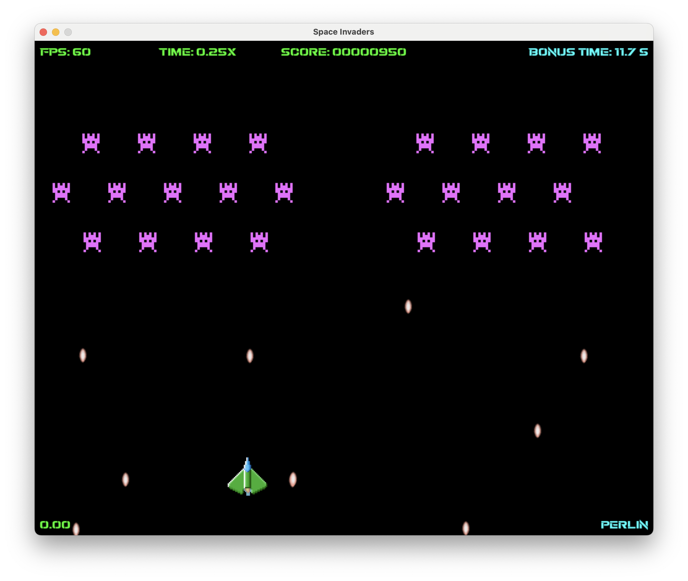
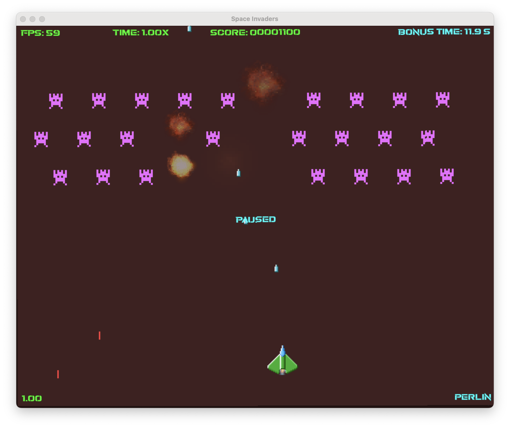

# Space Invaders Redux

This is a remake of the classic arcade game Space Invaders. It was made using Python and Pygame.

## 🚀 Introduction
The player controls a spaceship that can move horizontally and shoot projectiles. 

## 🏁 Objective
The objective is to destroy all the aliens before they reach the bottom of the screen.
The aliens can also shoot bullets and the player loses if the spaceship is hit by an alien bullet or if an alien reaches the bottom of the screen.

## 💯 Scoring System
The player earns points by destroying alien invaders.  
`+100 points` — Invader destroyed  
`-10 points` — Cost of an ammo round  
`+1000 points` — bonus for each second left on the timer

## 📷 Screenshot



## 🎮 Controls
`←` or `a` — Move the spaceship left  
`→` or `d` — Move the spaceship right  

`Space` — Shoot a projectile

`q` — Slow down the game (time factor 0.25x)  
`e` — Speed up the game (time factor 2x)  
`w` — Reset the game speed (time factor 1x)  

`p` — Pause the game  
`Esc` — Quit the game  

## 📦 Requirements
`Python` 3.12 +  
`Pygame` 2.5.x +
`numpy` 1.26.x +
`pyinstaller` 6.3.x +

## 🐑 Cloning the Repository
```
git clone git@github.com:iserk/space_invaders.git
cd space_invaders 
```

## 🚀 Running
```
pip install -r requirements.txt
python main.py
```

## 🔧 Building a Standalone Executable (Optional)
To build a standalone executable, run the following command:
```
pyinstaller --icon=assets/images/icon.png main.py
```
After it finishes, then copy the `assets` folder to the `dist/main` folder.

